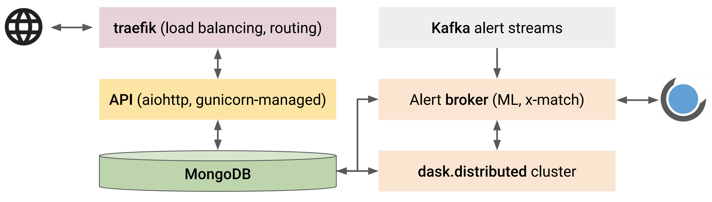

<div align="center">
   <picture>
      <source media="(prefers-color-scheme: dark)" srcset="https://github.com/skyportal/kowalski/raw/main/data/img/dark-logo.svg">
      <source media="(prefers-color-scheme: light)" srcset="https://github.com/skyportal/kowalski/raw/main/data/img/light-logo.svg">
      
   </picture>
   <h1>Kowalski</h1>
   <h2>a multi-survey data archive and alert broker for time-domain astronomy</h2>
   <br/><br/>
</div>

Kowalski is an API-driven multi-survey data archive and alert broker.
Its main focus is the [Zwicky Transient Facility](https://ztf.caltech.edu).

## Technical details

A schematic overview of the functional aspects of `Kowalski` and how they interact is shown below:



- A non-relational (NoSQL) database `MongoDB` powers the data archive, the alert stream sink,
and the alert handling service.
- An API layer provides an interface for the interaction with the backend:
it is built using a `python` asynchronous web framework, `aiohttp`, and the standard `python` async event loop
serves as a simple, fast, and robust job queue.
Multiple instances of the API service are maintained using the `Gunicorn` WSGI HTTP Server.
- A [programmatic `python` client](https://github.com/dmitryduev/penquins) is also available
to interact with Kowalski's API.
- Incoming and outgoing traffic can be routed through `traefik`,
which acts as a simple and performant reverse proxy/load balancer.
- An alert brokering layer listens to `Kafka` alert streams and uses a `dask.distributed` cluster for
distributed alert packet processing, which includes data preprocessing, execution of machine learning models,
catalog cross-matching, and ingestion into `MongoDB`.
It also executes user-defined filters based on the augmented alert data and posts the filtering results
to a [`SkyPortal`](https://skyportal.io/) instance.
- Kowalski is containerized using `Docker` software and orchestrated with `docker-compose`
allowing for simple and efficient deployment in the cloud and/or on-premise. However, it can also run without Docker especially for development purposes.

## Interacting with a `Kowalski` instance

`Kowalski` is an API-first system. The full OpenAPI specs can be found [here](https://kowalski.caltech.edu/docs/api/). Most users will only need the [queries section](https://kowalski.caltech.edu/docs/api/#tag/queries) of the specs.

The easiest way to interact with a `Kowalski` instance is by using a python client [`penquins`](https://github.com/dmitryduev/penquins).

## Cloning and Environment configuration

### Clone the repository
Start off by creating your own kowalski fork and github, and cloning it, then `cd` into the cloned directory:

```bash
git clone https://github.com/<your_github_id>/kowalski.git
cd kowalski
```

### Environment setup **on Linux amd64**

First, you'll need to install few system dependencies:

```bash
sudo apt install -y default-jdk wget
```

Make sure you have a version of python that is 3.8 or above before following the next steps.

Now, in the **same** terminal, run:

```bash
sudo pip install virtualenv
virtualenv env
source env/bin/activate
```

to create your virtual environment. If you are told that pip is not found, try using pip3 instead. For the following steps however (in the virtualenv), pip should work.


The python dependencies will be install automatically when you start the app. The same will happen for Kafka and the ML models.

### Environment setup **on MacOS arm64 (M1 or M2)**

First, you need to install several system dependencies using [homebrew](https://brew.sh):

```bash
brew install java librdkafka wget
```

After installing java, run the following to make sure it is accessible by kafka later on:
```
sudo ln -sfn /opt/homebrew/opt/openjdk/libexec/openjdk.jdk /Library/Java/JavaVirtualMachines/openjdk.jdk
echo 'export PATH="/opt/homebrew/opt/openjdk/bin:$PATH"' >> ~/.zshrc
```
Seperately, we install hdf5:
```bash
brew install hdf5
```
At the end of hdf5's installation, the path where it has been installed will be displayed in your terminal. Copy that path and make sure that you save it somewhere. You will need it when installing or updating python dependencies. We suggest you save it to your `.bashrc` or `.zshrc` file, by adding the following line:
```bash
export HDF5_DIR=<path_to_hdf5>
```

*Don't forget to source your `.zshrc` file after adding the above line, or else the path will not be accessible. You can also simply restart your terminal.*

Make sure you have a version of python that is 3.8 or above before following the next steps. You can consider installing a newer version with `homebrew` if needed.

To install a new version with homebrew, run:
```bash
brew install python@3.10
```
and then add the following line to your `.bashrc` or `.zshrc` file:
```bash
alias python='python3.10'
alias pip='pip3.10'
```

These lines will allow you to use that binary when calling python in your terminal. You can also use `python3.10` instead of `python` in the following steps.

*If you added it to your `.zshrc` file, don't forget to source it.*

Now, in the **same** terminal, run:

```bash
sudo pip install virtualenv
virtualenv env
source env/bin/activate
```

to create your virtual environment. If you are told that pip is not found, try using pip3 instead. For the following steps however (in the virtualenv), pip should work.

The python dependencies will be install automatically when you start the app. The same will happen for Kafka and the ML models.

## Spin up your own `kowalski` **without Docker**

### Setting up config files

Similar to the Docker setup, you need config files in order to run `Kowalski`. You can start off by copying the default config/secrets over. Here however, the default config file is `config.local.yaml`:

```bash
cp config.defaults.yaml config.yaml
```

### Setting up the MongoDB database

#### Running a local MongoDB instance
If you are running a local mongodb instance, the default config file should work out of the box, except if you are using a different port, a replica set, different database name or different usernames/passwords. In that case, you will need to edit the `database` section of the config file.

You can find detailed instructions on how to set up a MongoDB cluster [here](https://www.mongodb.com/docs/manual/installation/).

We also need to set the admin and user roles for the database. To do so, login to mongdb:

```bash
mongosh --host 127.0.0.1 --port 27017
```
and then from within the mongo terminal, set (using the default values from the config):

```bash
use admin
db.createUser( { user: "mongoadmin", pwd: "mongoadminsecret", roles: [ { role: "userAdmin", db: "admin" } ] } )
db.createUser( { user: "ztf", pwd: "ztf", roles: [ { role: "readWrite", db: "admin" } ] } )
use kowalski
db.createUser( { user: "mongoadmin", pwd: "mongoadminsecret", roles: [ { role: "userAdmin", db: "kowalski" } ] } )
db.createUser( { user: "ztf", pwd: "ztf", roles: [ { role: "readWrite", db: "kowalski" } ] } )
exit
```

#### Using MongoDB Atlas or a remote MongoDB instance

If you are using a mongodb atlas cluster, kowalski won't be able to create admin users, so you will need to do so manually on the cluster's web interface. You will need to create 2 users: admin user and user, based on what usernames and passwords you've set in the config file in the `database` section. *Don't forget to also allow access from your IP address, or simply allow access from anywhere.*

### Start and test the app

#### Starting the app

To start the app, run:

```bash
make run
```

This will start the API, the dask clusters and alert brokers.

#### Run the tests

To run the tests, run:

```bash
make test
```

If you want to run a specific test, you can do so by running:

```bash
PYTHONPATH=. pytest -s kowalski/tests/<test_file.py>
```

### Ingester (Pushing alerts to a local kafka topic)

Once the broker is running, you might want to create a local kafka stream of alerts to test it. To do so, you can run the ingester with

```bash
cd kowalski
```

and running:

```bash
PYTHONPATH=. python kowalski/tools/kafka_stream.py --topic="<topic_listened_by_your_broker>" --path="<alerts_folder_in_data>" --test=True
```

where `<topic_listened_by_your_broker>` is the topic listened by your broker (ex: `ztf_20200301_programid3` for the ztf broker) and `<alerts_folder_in_data>` is the path to the alerts in the `data/` directory of the kowalski app (ex: `ztf_alerts/20200202` for the ztf broker).

To stop the broker, you can simply press `Ctrl+C` in the terminal where you started it.


## Spin up your own `kowalski` **using Docker**

### Setting up config files

You need config files in order to run `Kowalski`. When running in docker, this is done with the `docker.yaml` file, which is already configured to use a database running in a mongodb container. If you need to make any other changes, you can copy the relevant sections from the `config.defaults.yaml` file into `docker.yaml`. You also need to create a `docker-compose.yaml` file. You can start off by copying the default config/secrets over:

```bash
cp docker-compose.defaults.yaml docker-compose.yaml
```

`config.defaults.yaml` contains the API and ingester configs, together with all the secrets. So be careful when committing code / pushing docker images.

However, if you want to run in a production setting, be sure to modify `docker.yaml` and choose strong passwords!

`docker-compose.yaml` serves as a config file for `docker-compose`, and can be used for different Kowalski deployment modes.
Kowalski comes with several template `docker-compose` configs (see [below](#different-deployment-scenarios) for more info).

### Building Kowalski

Finally, once you've set the config files, you can build an instance of Kowalski.
You can do this with the following command:

```bash
make docker_build
```

You have now successfully built a `Kowalski` instance!
Any time you want to rebuild `kowalski`, you need to re-run this command.

### Running Kowalski

* `make docker_up` to start up a pre-built Kowalski instance

### Running the tests

You can check that a running docker `Kowalski` instance is working by using the Kowalski test suite:

```bash
make docker_test
```

### Shutting down `Kowalski`

```bash
make docker_down
```

### Different Deployment scenarios (using Docker)

`Kowalski` uses `docker-compose` under the hood and requires a `docker-compose.yaml` file.
There are several available deployment scenarios:

- Bare-bones
- Bare-bones + broker for `SkyPortal` / `Fritz`
- Behind `traefik`

#### Bare-bones

Use `docker-compose.defaults.yaml` as a template for `docker-compose.yaml`.
Note that the environment variables for the `mongo` service must match
`admin_*` under `kowalski.database` in `config.yaml`.

#### Bare-bones + broker for [`SkyPortal`](https://skyportal.io/) / [`Fritz`](https://github.com/fritz-marshal/fritz)

Use `docker-compose.fritz.defaults.yaml` as a template for `docker-compose.yaml`.
If you want the alert ingester to post (filtered) alerts to `SkyPortal`, make sure
`{"misc": {"broker": true}}` in `config.yaml`.

#### Behind `traefik`

Use `docker-compose.traefik.defaults.yaml` as a template for `docker-compose.yaml`.

If you have a publicly accessible host allowing connections on port `443` and a DNS record with the domain
you want to expose pointing to this host, you can deploy `kowalski` behind [`traefik`](http://traefik.io),
which will act as the edge router -- it can do many things including load-balancing and
getting a TLS certificate from `letsencrypt`.

In `docker-compose.yaml`:
- Replace `kowalski@caltech.edu` with your email.
- Replace `private.caltech.edu` with your domain.

## API Docs

OpenAPI specs are to be found under `/docs/api/` once `Kowalski` is up and running.

## Developer guide

### How to contribute

Contributions to Kowalski are made through
[GitHub Pull Requests](https://help.github.com/en/github/collaborating-with-issues-and-pull-requests/about-pull-requests),
a set of proposed commits (or patches).

To prepare, you should:

- Create your own fork the [kowalski repository](https://github.com/dmitryduev/kowalski) by clicking the "fork" button.

- [Set up SSH authentication with GitHub](https://help.github.com/en/github/authenticating-to-github/connecting-to-github-with-ssh).

- Clone (download) your copy of the repository, and set up a remote called `upstream` that points to the main Kowalski repository.

  ```sh
  git clone git@github.com:<yourname>/kowalski
  git remote add upstream git@github.com:dmitryduev/kowalski
  ```

Then, for each feature you wish to contribute, create a pull request:

1. Download the latest version of Kowalski, and create a new branch for your work.

   Here, let's say we want to contribute some documentation fixes; we'll call our branch `rewrite-contributor-guide`.

   ```sh
   git checkout master
   git pull upstream master
   git checkout -b rewrite-contributor-guide
   ```

2. Make modifications to Kowalski and commit your changes using `git add` and `git commit`.
Each commit message should consist of a summary line and a longer description, e.g.:

   ```text
   Rewrite the contributor guide

   While reading through the contributor guide, I noticed several places
   in which instructions were out of order. I therefore reorganized all
   sections to follow logically, and fixed several grammar mistakes along
   the way.
   ```

3. When ready, push your branch to GitHub:

   ```sh
   git push origin rewrite-contributor-guide
   ```

   Once the branch is uploaded, GitHub should print a URL for turning your branch into a pull request.
   Open that URL in your browser, write an informative title and description for your pull request, and submit it.
   There, you can also request a review from a team member and link your PR with an existing issue.

4. The team will now review your contribution, and suggest changes.
*To simplify review, please limit pull requests to one logical set of changes.*
To incorporate changes recommended by the reviewers, commit edits to your branch, and push to the branch again
(there is no need to re-create the pull request, it will automatically track modifications to your branch).

5. Sometimes, while you were working on your feature, the `master` branch is updated with new commits, potentially
resulting in conflicts with your feature branch. To fix this, please merge in the latest `upstream/master` branch:

    ```shell script
    git merge rewrite-contributor-guide upstream/master
    ```
Developers may merge `master` into their branch as many times as they want to.

6. Once the pull request has been reviewed and approved by at least two team members, it will be merged into Kowalski.

### Pre-commit hook

Install our pre-commit hook as follows:

```
pip install pre-commit
pre-commit install
```

This will check your changes before each commit to ensure that they
conform with our code style standards. We use `black` to reformat `Python`
code and `flake8` to verify that code complies with [PEP8](https://www.python.org/dev/peps/pep-0008/).


### Add a new alert stream to Kowalski

To add a new alert stream to kowalski, see the [PR](https://github.com/skyportal/kowalski/pull/174) associated with the addition of WINTER to Kowalski.
A brief summary of the changes required (to add WINTER into Kowalski, but hopefully can be extended to any other survey) is given below -
1. A new `kowalski/alert_brokers/alert_broker_<winter>.py` needs to be created for the new alert stream. This can be modelled off the existing alert_broker_ztf.py or alert_broker_pgir.py scripts, with the following main changes -

   a. `watchdog` needs to be pointed to pull from the correct topic associated with the new stream

   b. `topic_listener` needs to be updated to use the correct dask-ports associated with the new stream from the config file  (every alert stream should have different dask ports to avoid conflicts). `topic_listener` also needs to be updated to use the `<WNTR>AlertConsumer` asociated with the new stream.

   c. `<WNTR>AlertConsumer` needs to be updated per the requirements of the survey. For example, WINTER does not require MLing prior to ingestion, so that step is excluded unlike in the `ZTFAlertConsumer`. The `WNTRAlertConsumer` also does a cross-match to the ZTF alert stream, a step that is obviously not present in `ZTFAlertConsumer`.

   d. `<WNTR>AlertWorker` needs to be updated to use the correct stream from SkyPortal. `alert_filter__xmatch_ztf_alerts` needs to be updated with the new survey-specific cross-match  radius (2 arcsec for WINTER).

2. In `kowalski/alert_brokers/alert_broker.py`, `make_photometry` needs to be updated with the filterlist and zeropoint system appropriate for the new stream.

3. A new `kowalski/dask_clusters/dask_cluster_<winter>,py` needs to be created, modeled on `dask_cluster.py` but using the ports for the new stream from the config file.

4. The config file `config.defaults.yaml` needs to be updated to include the collections, upstream filters, crossmatches, dask ports, and ml_models (if MLing is necessary) for the new stream. No two streams should use the same ports for dask to avoid conflicts. Entries also need to be made in the `supervisord_<api_or_ingester.conf.template` configs found in the `conf` directory.

5. Some alerts need to be added to `data/` for testing. Tests for alert ingestion (`tests/test_ingester_<wntr>.py`) and alert processing (`tests/test_alert_broker_wntr.py`) can be modeled on the ZTF tests, with appropriate changes for the new stream. The ingester test is where you will be able to create a mock kafka stream to test your broker.

6. Need to edit `ingester.Dockerfile` so that all new files are copied into the docker container (add or modify the COPY lines).

### Add a new ML model to Kowalski

For now, only the ZTF alert stream has a method implement to run ML models on the alerts. However, this can be extended as reused as a basis to run ML models on other streams as well.

To add a new ML model to run on the ZTF alert stream, you simply need to add the model to the `models` directory, where you create a directory named after your instrument, which will contain the models you want to add. The models need to be referenced in the config file in the `ml` section, in a key named after your instrument. The name of that key lowered will be the name of the directory added in the `models` directory. The model will then be automatically loaded and will run on the alerts. In the configm you cqn provide an URL for your model. This will ensure that the model is downloaded and added in the right directory when Kowalski is started.

Here are the exact steps to add a new ML model to Kowalski:

1. Add the model in .h5 format, or if you are using a .pb format you can also add the model files and directories in a folder called `<instrument_name_lowered>` in the `models` directory.

2. Add the model name to `models.<instrument_name>.<model_name>` in the config file. All models need to have at least the following fields:

   - `triplet`: True or False, whether the model uses the triplet (images) or not as an input to the model
   - `feature_names`: list of features used by the model as a tuple, they need to be a subset of the `ZTF_ALERT_NUMERICAL_FEATURES` found in `kowalski/utils.py`. Ex: `('drb', 'diffmaglim', 'ra', 'dec', 'magpsf', 'sigmapsf')`
   - `version`: version of the model
   - `url`: URL to download the model from. This is useful so that Kowalski can download the model when it starts, and you don't need to add the model to the `models` directory. If you don't provide a URL, Kowalski will look for the model in the `models` directory.

3. Then, you might want to provide additional information about the model, such as:
   - `feature_norms`: dictionary of feature names and their normalization values, if the model was trained with normalized features
   - `order`: in which order do the triplet and features need to be passed to the model. ex: `['triplet', 'features']` or `['features', 'triplet']`
   - `format`: format of the model, either `h5` or `pb`. If not provided, the default is `h5`.

The best way to see if the model is being loaded correctly is to run the broker tests. These tests will show you the models that are running, and the errors encountered when loading the models (if any).

### Ingest Catalogs in Kowalski (fits, csv)

To ingest a new catalog into Kowalski from a fits, csv, or parquet file, you can use the `ingest_catalog.py` script in the `ingesters` directory. To use it, run:

```bash
PYTHONPATH=. python kowalski/ingesters/ingest_catalog.py --catalog_name="TEST" --path="data/catalogs/<your_file.fits_csv_or_parquet>" --max_docs=500 --ra_col="RA" --dec_col="DEC" --format="<fits_csv_or_parquet>"
```

The max_docs argument is optional, and if not provided, the entire catalog will be ingested. We advise setting it to somewhere between 1 and 10 the first time, to assess if the catalog is being ingested as expected before ingesting the rest. If you want to specify the RA and Dec columns, you can use the `--ra_col` and `--dec_col` arguments; if not provided, the script will try to find the RA and Dec columns in the catalog. The format argument is also optional, and if not provided, the script will try to process the file as a fits file. The catalog name argument and the path are required.

Once a catalog has been added, you can perform cross-matches between the catalog and candidates. To do so, add the catalog and the cross-match conditions (like the search radius) in the `database.xmatch.<instrument_name>` section of the config file.

Here is an example of how to add a cross-match between the ZTF alert stream and a catalog called `TEST`, which has some columns called `j_m`, `h_m`, and `k_m`, and for which we want to perform a cross-match with a search radius of 2 arcsec:

```yaml
ZTF:
   TEST:
      cone_search_radius: 2
      cone_search_unit: "arcsec"
      filter: {}
      projection: #column for your catalog that you want to have in the crossmatch results
         _id: 1
         coordinates.radec_str: 1
         j_m: 1
         h_m: 1
         k_m: 1
```
